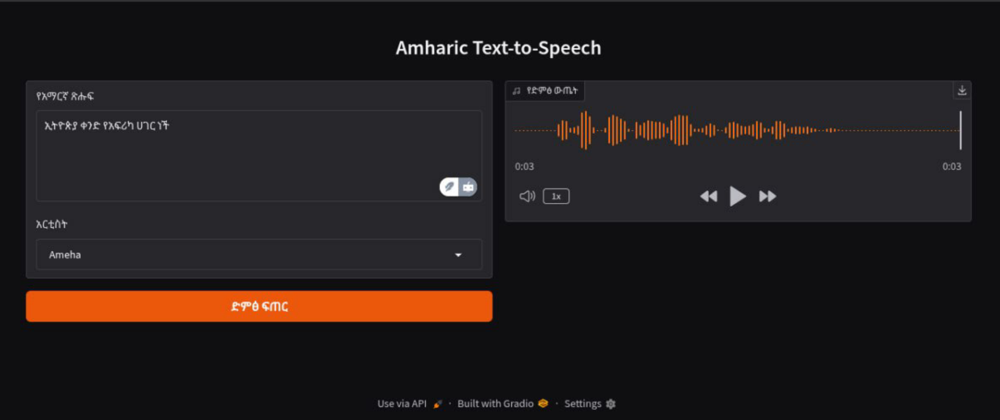

```markdown
# Amharic Text-to-Speech (TTS) Application



[](https://opensource.org/licenses/MIT)
[](https://www.python.org/downloads/)

A simple web-based Text-to-Speech application focused on Amharic language support, powered by Microsoft Edge TTS.


## Features ✨
- 🗣️ Native Amharic voice support (Male & Female)
- 🌍 Web interface with Amharic localization
- ⚡ Real-time speech synthesis
- 🎧 Direct audio playback in browser
- 🛠️ Error handling with Amharic/English messages
- ⏱️ 30-second timeout protection

## Supported Voices 🎶
| Name   | Gender | Voice ID           |
|--------|--------|--------------------|
| Ameha  | Male   | `am-ET-AmehaNeural`|
| Mekdes | Female | `am-ET-MekdesNeural`|

## Installation 💻

### Prerequisites
- Python 3.8+
- pip package manager

### Steps
1. Clone repository:
```bash
git clone https://github.com/snackshell/amharic-tts.git
cd amharic-tts
```

2. Create virtual environment:
```bash
python -m venv venv
source venv/bin/activate  # Linux/Mac
venv\Scripts\activate     # Windows
```

3. Install dependencies:
```bash
pip install -r requirements.txt
```

## Usage 🚀
1. Start the application:
```bash
python app.py
```

2. Access the interface at:
```
http://localhost:7860
```

3. Enter Amharic text and select a voice:
   - Type/paste text in the input box
   - Choose between Ameha (Male) or Mekdes (Female)
   - Click "ድምፅ ፍጠር" (Generate Audio)

4. Play generated audio using the built-in player

## Technical Details 🔧
### Architecture


### Key Technologies
- Python 3.10+
- Gradio (Web Interface)
- edge-tts (TTS Engine)
- asyncio (Async Operations)
- tempfile (Audio File Handling)

## Contributing 🤝
Contributions are welcome! Please follow these steps:
1. Fork the repository
2. Create a feature branch (`git checkout -b feature/your-feature`)
3. Commit changes (`git commit -m 'Add some feature'`)
4. Push to branch (`git push origin feature/your-feature`)
5. Open a Pull Request

## License 📄
This project is licensed under the MIT License - see [LICENSE](LICENSE) file for details.

## Acknowledgments 🙏
- Microsoft Edge TTS services
- Gradio team for the web interface framework
- [Bana Codes](https://t.me/banacodes) community for Amharic language support
```

Create these additional files:

1. **requirements.txt**
```text
gradio==4.13.0
edge-tts==6.1.3
python-dotenv==1.0.0
```
